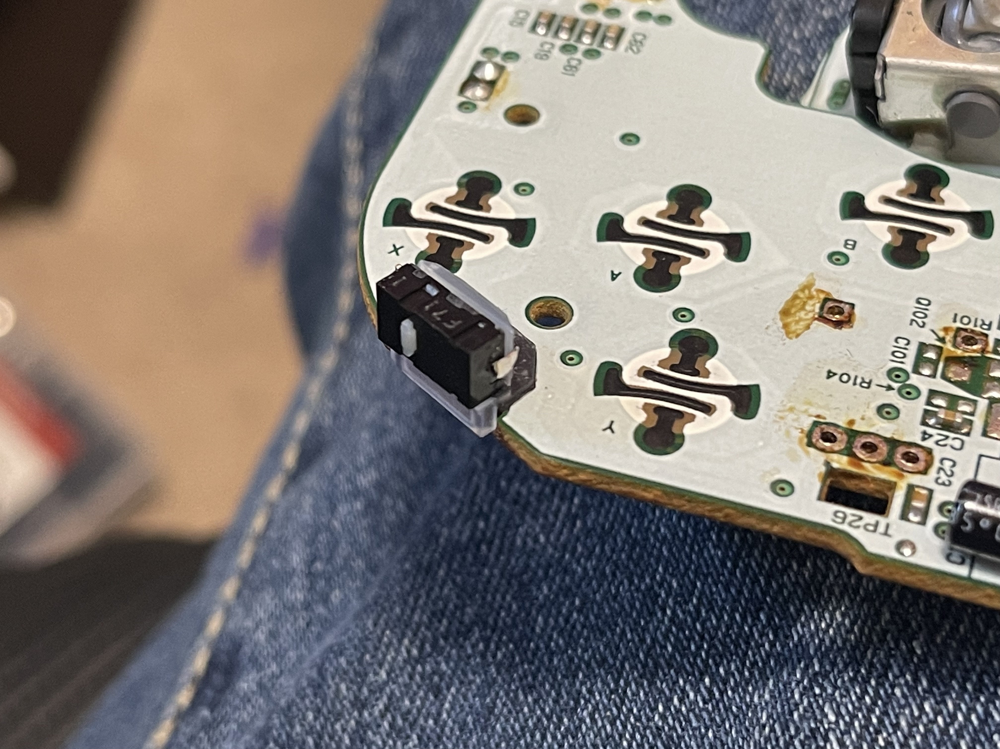

# gcc-mouseswitch-z

Replaces stock GCC Z button with a Omron D2LS mouse switch.

NEW! - Universal brackets work on Phob, Goomwave, and OEM controllers.

More details at https://simplecontrollers.bigcartel.com/mouseswitch-z

Recommended Switch D2LS-11:
https://www.digikey.com/en/products/detail/D2LS-11/Z4377CT-ND/5031940?curr=usd&utm_campaign=buynow&utm_medium=aggregator&utm_source=octopart

Alternative option (lower force):
https://www.digikey.com/en/products/detail/omron-electronics-inc-emc-div/D2LS-21/5031942?s=N4IgTCBcDaICJgDIGUC0YCMIC6BfIA

